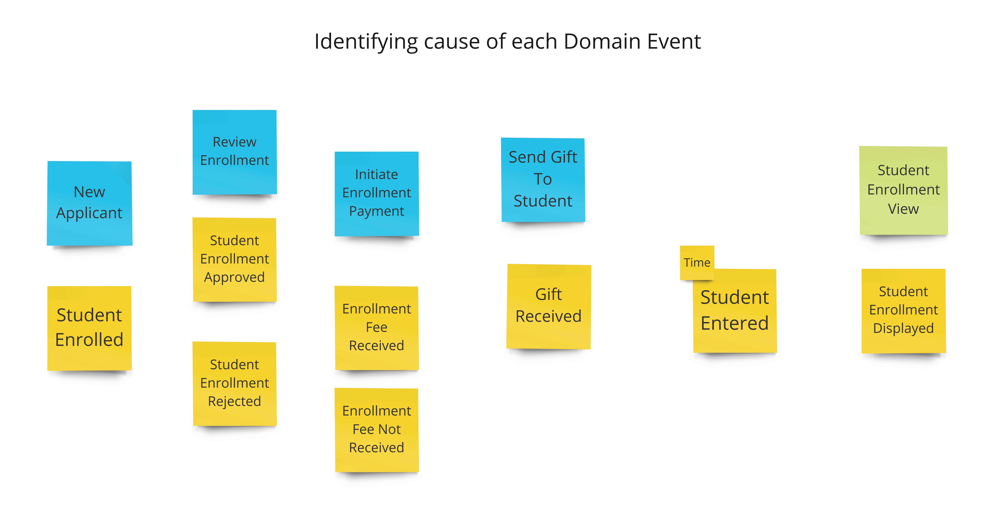
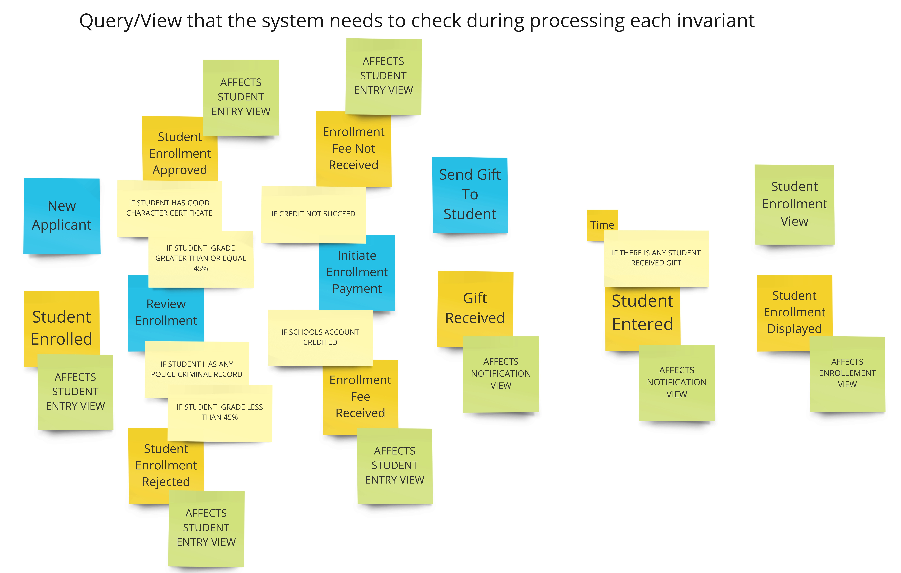

= The Example : Student Management System

=== UNDERSTAND -> (Event Storming)

First of all, let's discover domain events on student management system.

image::docs/Discovering Domain Events.jpg[Discovering Domain Events]

Then, identify cause of each domain event like:

Now, identifying invariants or conditions of each Domain Event

image::docs/Identifying invariants or conditions of each Domain Event.jpg[Identifying invariants or conditions of each Domain Event]

Let's write down the name of a query/view that the system needs to check during processing each invariant.

