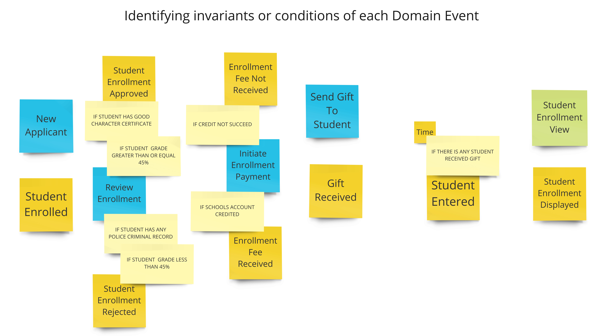
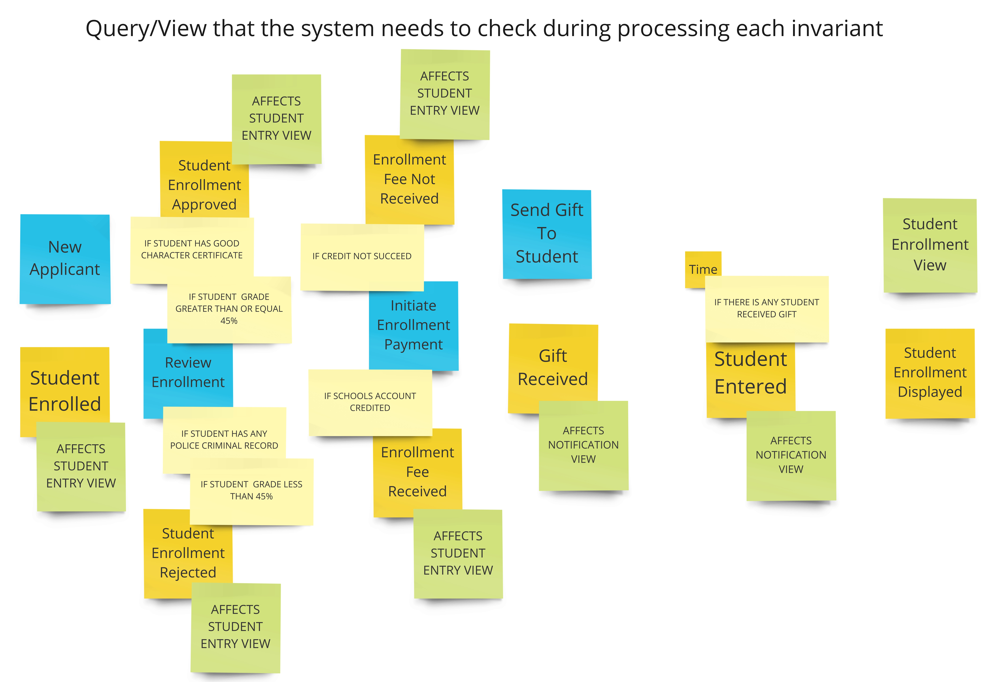
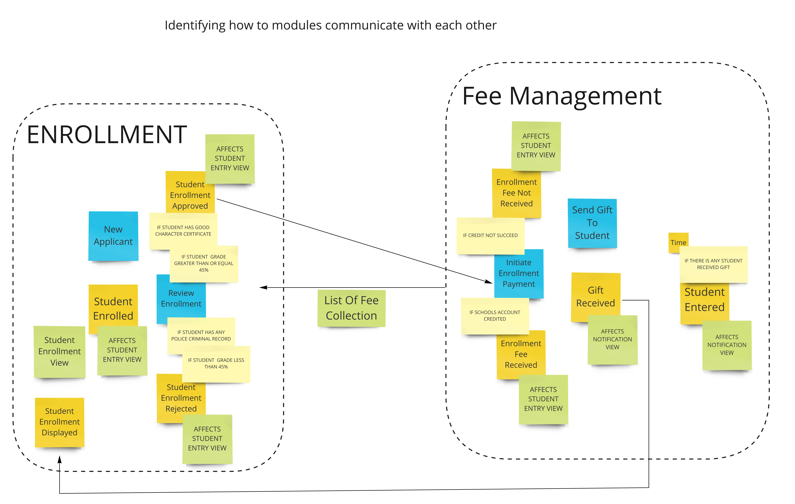
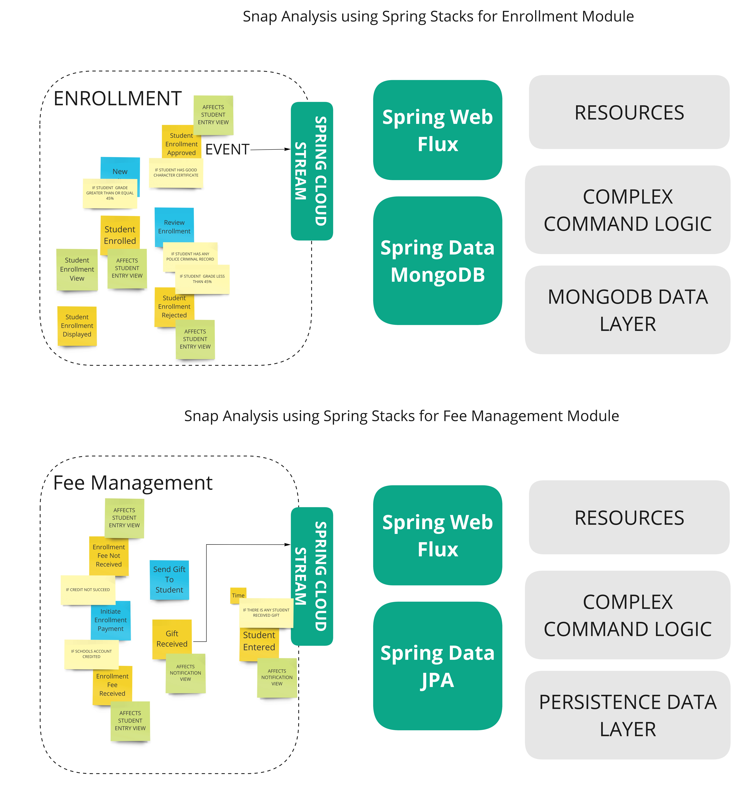

= The Example : Student Management System

=== UNDERSTAND -> (Event Storming)

First of all, let's discover domain events on student management system.

image::docs/1.Discovering Domain Events.jpg[Discovering Domain Events]

Then, identify cause of each domain event like:

image::docs/2.Identifying cause of each Domain Event.jpg[Identifying cause of each Domain Event]

Now, identifying invariants or conditions of each Domain Event

Let's write down the name of a query/view that the system needs to check during processing each invariant.

Now, let's divide into highly cohesive modules so called bounded context.

image::docs/5.Divide into highly cohesive modules so called Bounded Contexts.jpg[Divide into highly cohesive modules so called Bounded Contexts]

Then, we need to identifying how to modules communicate with each other.

Finally, we need to do snap analysis using Spring Stacks for each bounded context.

